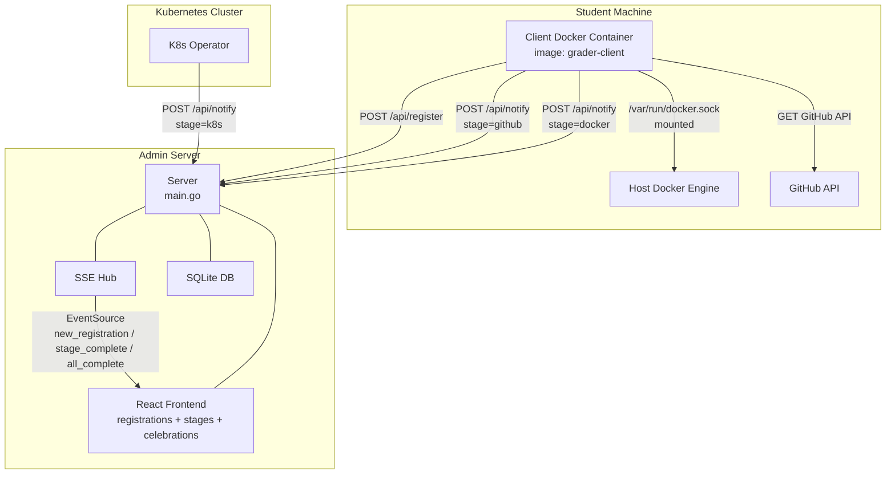
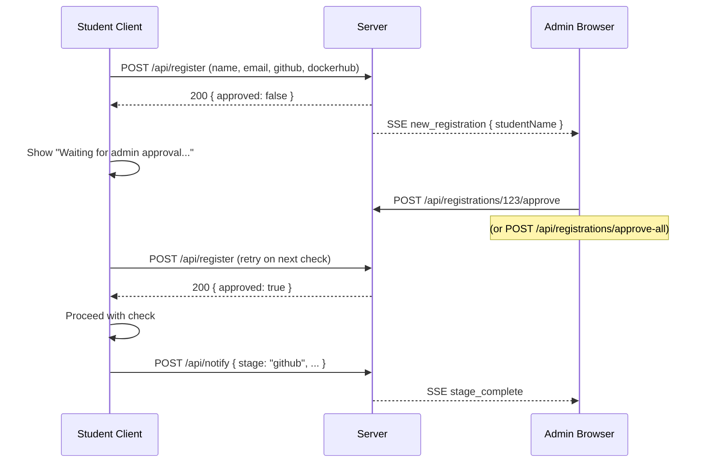

# Split into Server and Client (Multi-Stage + Registration Approval + Celebrations)

## Current Architecture

Single binary at `[main.go](main.go)` that does everything: student CRUD, Docker-based grading, and frontend serving. The Docker runner in `[internal/docker/runner.go](internal/docker/runner.go)` pulls student images, runs them, and verifies the `/api/info` response.

## Target Architecture




### Registration Approval Flow




- When a student clicks "Check GitHub" or "Check Docker", the client first calls `POST /api/register` on the server
- If the student doesn't exist, the server creates them with `approved: false`
- If the student exists but is not approved, the server returns `{ approved: false }` — the client shows "Waiting for admin approval"
- If the student is approved, the server returns `{ approved: true }` — the client proceeds with the check
- New registrations push a `new_registration` SSE event so the admin sees them in real time
- The admin has a **Registration Requests** page with "Approve" per-row and "Approve All" buttons

### Client Distribution

Students run the client as a Docker container:

```bash
docker run -d \
  -p 3000:3000 \
  -v /var/run/docker.sock:/var/run/docker.sock \
  -e SERVER_URL=http://10.0.0.1:8080 \
  -e IMAGE_NAME=workshop-app \
  -e GITHUB_REPO=devops-workshop \
  grader-client
```

- Config via **env vars** (`SERVER_URL`, `IMAGE_NAME`, `GITHUB_REPO`), falls back to mounted `config.json`
- Host Docker socket mounted for Docker stage
- Student opens `http://localhost:3000`

### Three Stages

- **GitHub** (runs on client): Checks if `main.go` exists in `github.com/<github_username>/<repo>` (repo name from config) via GitHub API
- **Docker** (runs on client): Pulls `<dockerhub_username>/<image_name>` (image_name from config), runs it via host Docker, verifies `/api/info` response
- **Kubernetes** (external operator): K8s operator calls `POST /api/notify` with `stage=k8s` directly

Each stage is tracked independently. The admin dashboard shows per-stage pass/fail status.

### Real-Time Celebrations + Missed Event Handling

When `POST /api/notify` records a stage pass, the server pushes an SSE event:

- **Single stage pass** -> `stage_complete` -> modal: "**John Doe** completed **GitHub** stage!"
- **All 3 stages pass** -> `all_complete` -> confetti modal: "**John Doe** completed all stages!"
- **New registration** -> `new_registration` -> admin Registration Requests page auto-refreshes

**Missed events**: "Refresh" button on pages re-fetches data. `useSSE` hook shows "Reconnecting..." and auto-reconnects.

## Detailed Changes

### 1. Update: `[internal/models/student.go](internal/models/student.go)`

```go
type Student struct {
    ID                uint       `json:"id" gorm:"primaryKey"`
    Name              string     `json:"name" gorm:"not null"`
    Email             string     `json:"email" gorm:"not null;uniqueIndex"`
    GitHubUsername    string     `json:"githubUsername" gorm:"not null"`
    DockerHubUsername string     `json:"dockerHubUsername" gorm:"not null"`
    Approved          bool       `json:"approved" gorm:"not null;default:false"`

    GitHubStatus        string     `json:"githubStatus" gorm:"not null;default:pending"`
    GitHubErrorMessage  string     `json:"githubErrorMessage"`
    GitHubLastCheckedAt *time.Time `json:"githubLastCheckedAt"`

    DockerStatus        string     `json:"dockerStatus" gorm:"not null;default:pending"`
    DockerErrorMessage  string     `json:"dockerErrorMessage"`
    DockerLastCheckedAt *time.Time `json:"dockerLastCheckedAt"`

    K8sStatus        string     `json:"k8sStatus" gorm:"not null;default:pending"`
    K8sErrorMessage  string     `json:"k8sErrorMessage"`
    K8sLastCheckedAt *time.Time `json:"k8sLastCheckedAt"`

    CreatedAt time.Time  `json:"createdAt"`
    UpdatedAt time.Time  `json:"updatedAt"`
}
```

**Removed**: `RollNo`, `Status`, `ErrorMessage`, `LastCheckedAt`. **Added**: `Approved` (default `false`). Add helper `AllPassed() bool`.

### 2. New file: `internal/github/checker.go`

```go
func CheckRepoFile(ctx context.Context, username, repo, filePath string) error
```

- `GET https://api.github.com/repos/<username>/<repo>/contents/<filePath>`
- Returns `nil` if 200, error otherwise

### 3. New file: `internal/sse/hub.go`

Thread-safe SSE broadcast hub. Three event types: `new_registration`, `stage_complete`, `all_complete`.

```go
type Event struct {
    Type string      // "new_registration", "stage_complete", or "all_complete"
    Data interface{}
}

type Hub struct { ... }
func NewHub() *Hub
func (h *Hub) Subscribe() (<-chan Event, func())
func (h *Hub) Broadcast(event Event)
```

### 4. New file: `internal/handlers/register.go`

Client registration endpoint:

```go
// POST /api/register
// Body: { "name": "...", "email": "...", "githubUsername": "...", "dockerHubUsername": "..." }
// Response: { "id": 1, "approved": false, ... }
```

- Looks up student by `email`
- If not found: creates with `approved: false`, broadcasts `new_registration` SSE event
- Returns the student record (client checks the `approved` field to decide whether to proceed)

### 5. New file: `internal/handlers/approval.go`

Admin approval endpoints:

```go
// POST /api/registrations/:id/approve  — approve a single student
// POST /api/registrations/approve-all  — approve all unapproved students
```

- Sets `Approved = true` on the student(s)
- Returns the updated record(s)

### 6. New file: `internal/handlers/notify.go`

Stage notification endpoint:

```go
// POST /api/notify
// Body: { "stage": "github|docker|k8s", "email": "...", "name": "...",
//         "githubUsername": "...", "dockerHubUsername": "...",
//         "passed": true, "errorMessage": "" }
```

- Looks up student by `email`
- If student not found or **not approved**: returns `403 { "error": "student not approved" }`
- Updates the stage-specific status/error/timestamp fields
- If stage newly passed, broadcasts `stage_complete` SSE event
- If all 3 stages now passed, also broadcasts `all_complete` SSE event
- Returns the updated student record

### 7. New file: `internal/handlers/events.go`

SSE endpoint: `GET /api/events`

- `Content-Type: text/event-stream`
- Subscribes to Hub, writes events, cleans up on disconnect

### 8. Modify: `[main.go](main.go)` (server entry point)

- Remove `docker.NewRunner()` and `CheckHandler`
- Remove routes: `POST /api/run-check` and `POST /api/run-check/:id`
- Create SSE `Hub` and wire into handlers
- Add routes:
  - `POST /api/register`
  - `POST /api/notify`
  - `GET /api/events`
  - `POST /api/registrations/:id/approve`
  - `POST /api/registrations/approve-all`
- Everything else (student CRUD, frontend embed) stays the same

### 9. Delete: `[internal/handlers/check.go](internal/handlers/check.go)`

No longer needed.

### 10. New file: `cmd/client/main.go`

Go web server. Config from env vars, fallback to `config.json`.

**Endpoints:**

- `POST /api/register` (proxy):
  1. Forward student info to `POST <server_url>/api/register`
  2. Return the server response (includes `approved` field) to the frontend
- `POST /api/check/github`:
  1. Call `POST <server_url>/api/register` with student info
  2. If response has `approved: false` -> return `{ status: "not_approved" }` to frontend
  3. If approved -> run `github.CheckRepoFile(...)` -> POST result to `<server_url>/api/notify` with `stage: "github"`
  4. Return result to frontend
- `POST /api/check/docker`:
  1. Call `POST <server_url>/api/register` with student info
  2. If not approved -> return `{ status: "not_approved" }`
  3. If approved -> run `docker.Runner.CheckStudent(...)` with image `<dockerHubUsername>/<config.ImageName>` -> POST to `/api/notify` with `stage: "docker"`
  4. Return result to frontend
- Serves embedded HTML frontend on `/` (port 3000)

### 11. New file: `cmd/client/frontend.html` (embedded)

Single-page HTML with embedded CSS:

- **Form fields**: Student Name, GitHub Username, Docker Hub Username, Email
- **Three buttons**:
  - **"Register"** — calls `POST /api/register`, shows approval status. If already approved, shows a green "Approved" badge. If pending, shows "Waiting for admin approval..." message.
  - **"Check GitHub"** — calls `POST /api/check/github`. Disabled until approved. Shows pass/fail result inline.
  - **"Check Docker"** — calls `POST /api/check/docker`. Disabled until approved. Shows pass/fail result inline.
- **Flow**: Student fills the form -> clicks "Register" -> waits for approval -> once approved, the check buttons become enabled -> student runs checks independently
- If a check button is clicked while not yet approved, it returns "not_approved" and the UI shows a reminder to wait

### 12. New file: `Dockerfile.client`

Multi-stage Docker build (unchanged from previous plan):

```dockerfile
FROM golang:1.25-alpine AS builder
WORKDIR /src
COPY go.mod go.sum ./
RUN go mod download
COPY . .
RUN CGO_ENABLED=0 go build -o /client ./cmd/client

FROM alpine:3.21
RUN apk add --no-cache ca-certificates
COPY --from=builder /client /usr/local/bin/client
EXPOSE 3000
ENTRYPOINT ["client"]
```

### 13. Update: `[internal/handlers/student.go](internal/handlers/student.go)`

- Remove `RollNo` from `studentPayload`
- Add `GitHubUsername` and `DockerHubUsername` (both required)
- Update `CreateStudent` / `UpdateStudent`

### 14. Admin frontend: types and API client

`**[frontend/src/types/student.ts](frontend/src/types/student.ts)**`:

```typescript
export type StudentStatus = "pending" | "passed" | "failed";
export type StageName = "github" | "docker" | "k8s";

export interface Student {
  id: number;
  name: string;
  email: string;
  githubUsername: string;
  dockerHubUsername: string;
  approved: boolean;

  githubStatus: StudentStatus;
  githubErrorMessage: string;
  githubLastCheckedAt: string | null;

  dockerStatus: StudentStatus;
  dockerErrorMessage: string;
  dockerLastCheckedAt: string | null;

  k8sStatus: StudentStatus;
  k8sErrorMessage: string;
  k8sLastCheckedAt: string | null;

  createdAt: string;
  updatedAt: string;
}

export interface CreateStudentPayload {
  name: string;
  email: string;
  githubUsername: string;
  dockerHubUsername: string;
}

export interface StageCompleteEvent { studentName: string; stageName: StageName; }
export interface AllCompleteEvent { studentName: string; }
export interface NewRegistrationEvent { studentName: string; studentId: number; }
```

`**[frontend/src/api/client.ts](frontend/src/api/client.ts)**`:

- Remove `runCheckAll` and `runCheckById`
- Add `approveStudent(id: number)` -> `POST /api/registrations/:id/approve`
- Add `approveAll()` -> `POST /api/registrations/approve-all`
- `listStudents` already works for fetching all students (filter by `approved` status on the page)

### 15. Admin frontend: page updates

`**[frontend/src/pages/StudentList.tsx](frontend/src/pages/StudentList.tsx)**`:

- Remove "Run Check All" button and per-row "Re-check" button
- Remove Roll No column
- Add GitHub Username, Docker Hub Username columns
- Replace single Status column with three mini-badge columns: GitHub | Docker | K8s
- Summary line shows counts per stage
- Add "Refresh" button
- Only show **approved** students on this page

`**[frontend/src/pages/StudentProfile.tsx](frontend/src/pages/StudentProfile.tsx)`**:

- Remove "Run Check" button
- Show GitHub Username, Docker Hub Username, approval status
- Stage progress section: three cards for GitHub, Docker, K8s with status/error/timestamp

`**[frontend/src/pages/AddStudent.tsx](frontend/src/pages/AddStudent.tsx)`**:

- Remove Roll No field
- Add GitHub Username and Docker Hub Username fields

### 16. New admin page: `frontend/src/pages/RegistrationRequests.tsx`

Dedicated page for managing client registration requests:

- Lists all students where `approved === false`
- Table columns: Name, Email, GitHub Username, Docker Hub Username, Registered At
- Per-row **"Approve"** button
- Header **"Approve All"** button
- "Refresh" button to re-fetch
- Auto-refreshes when `new_registration` SSE event is received (via `useSSE` hook)
- After approval, student disappears from this page and appears in the main Students list

**Add to router** in `[frontend/src/App.tsx](frontend/src/App.tsx)`:

```typescript
<Route element={<RegistrationRequestsPage />} path="registrations" />
```

**Add to nav** in `[frontend/src/components/Layout.tsx](frontend/src/components/Layout.tsx)`:

```typescript
{ to: "/registrations", label: "Registrations" }
```

### 17. Admin frontend: celebration components + SSE (new files)

`**frontend/src/config.ts**` (new):

```typescript
export const POPUP_CONFIG = {
  stageCompleteDismissSeconds: 4,
  allCompleteDismissSeconds: 6,
};
```

Configurable dismiss times for all celebration popups. Change these values to adjust how long modals stay visible.

`**frontend/src/hooks/useSSE.ts**`:

- Opens `EventSource` to `/api/events`
- Parses `stage_complete`, `all_complete`, and `new_registration` events
- Manages an internal **event queue** (FIFO) for celebration popups
- Exposes:
  - `currentEvent` — the celebration event currently being shown (or `null`)
  - `dismissCurrent()` — manually dismiss the current popup (also called automatically by timer)
  - `newRegistrationCount` — increments on `new_registration` events so pages can react
  - `connected` — boolean for reconnection indicator
- Auto-reconnects on disconnect
- **Multi-popup queue logic**: When multiple events arrive while one is showing, they are queued. After the current popup is dismissed (by timer or click), the next one in the queue is shown. No popups are dropped.

`**frontend/src/components/StageCompleteModal.tsx`**:

- Modal: "**{studentName}** completed the **{stageName}** stage!"
- Fade in + slide up animation
- Auto-dismiss after `POPUP_CONFIG.stageCompleteDismissSeconds` seconds
- Click anywhere to dismiss early

`**frontend/src/components/AllCompleteModal.tsx`**:

- Full-screen confetti overlay: "**{studentName}** completed all stages!"
- `canvas-confetti` package for confetti burst
- Auto-dismiss after `POPUP_CONFIG.allCompleteDismissSeconds` seconds
- Click anywhere to dismiss early

**Wire into `[frontend/src/components/Layout.tsx](frontend/src/components/Layout.tsx)`**:

- Uses `useSSE` hook
- Reads `currentEvent` — renders `StageCompleteModal` or `AllCompleteModal` based on event type
- When the current popup's timer fires or user clicks dismiss, calls `dismissCurrent()` which shifts to the next queued event
- Shows "Reconnecting..." indicator in header when SSE disconnected

**New dependency**: `canvas-confetti`

### 18. Keep unchanged

- `[internal/docker/runner.go](internal/docker/runner.go)` — used by client
- `[internal/database/db.go](internal/database/db.go)` — used by server

### 19. Rewrite: `[README.md](README.md)`

Full rewrite covering:

- Overview, architecture diagram
- Server: endpoints (CRUD + register + approve + notify + events), dev/prod instructions
- Client: Docker image, `docker run` example, config reference, local dev
- Registration approval flow explanation
- Three assessment stages
- Real-time celebrations

