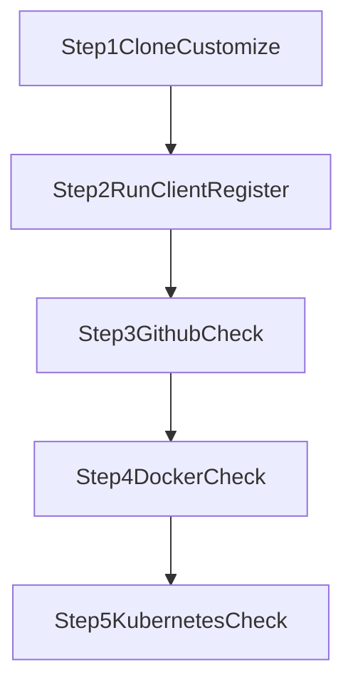

# DevOps Workshop Guide

Welcome to the student guide for the DevOps Assessment Grader. This workshop takes you through GitHub, Docker, and Kubernetes in a practical, step-by-step flow.

## What You Will Do

- Clone and customize a starter app
- Register in the grader client
- Pass GitHub and Docker checks
- Deploy to Kubernetes and complete the K8s stage

## Prerequisites

- Git installed
- Docker Desktop (or Docker Engine) running
- A GitHub account
- A Docker Hub account
- A browser
- Instructor-provided grader server URL (`http://<instructor-server-ip>:8080`)

## Workshop Roadmap (5 Steps)

1. [Step 1 - Clone and Customize](./step1-clone-and-customize.md)
2. [Step 2 - Set Up Grader Client and Register](./step2-setup-grader-client.md)
3. [Step 3 - Run GitHub Check](./step3-check-github.md)
4. [Step 4 - Build and Push Docker Image, Run Docker Check](./step4-build-and-push-docker.md)
5. [Step 5 - Deploy to Kubernetes and Complete K8s Check](./step5-kubernetes.md)

## Important Links

- Starter repo: [prasannakumar414/docker-assessment-test](https://github.com/prasannakumar414/docker-assessment-test)
- Pre-built grader client image: [prasannakumar08/docker-assesment-test-notify](https://hub.docker.com/repository/docker/prasannakumar08/docker-assesment-test-notify/general)
- Troubleshooting: [Common Issues and FAQ](./troubleshooting.md)

## Assessment Flow

Use the pages in order. Each step includes exact commands and common fixes.
